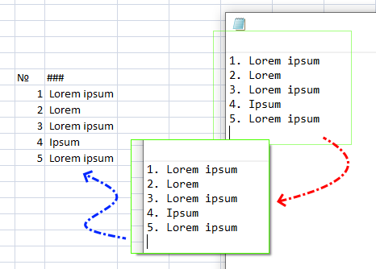
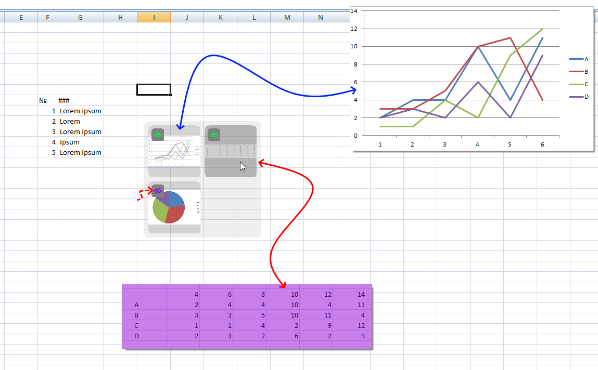
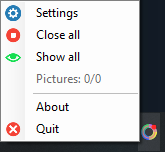
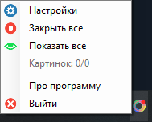
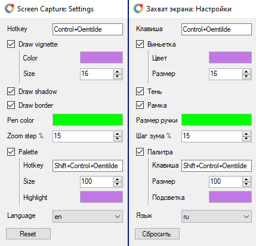

# Screen Capture / Захват экрана

### [Download / Скачать [v1.5]](https://github.com/MixelTe/ScreenCapture/releases/download/v1.5/ScreenCapture.exe)
Capture screen zone and show it as floating topmost window.

Сохраняет часть экрана и отображает её в виде окна поверх всего.

---

For example, you can cut a list from one place and move it closer to the workspace.

Например, вы можете вырезать какой-то список из одного места и переместить его поближе к рабочей области.

You can use the palette to manage all the images. There you can show/hide, close and move to the cursor any image.

С помощью палитры вы можете управлять всеми изображениями. Там вы можете показывать/скрывать, закрывать и перемещать к курсору изображения.

The app is located on the taskbar.

Приложение размещено на панели задач.

 

You can change almost anything in the settings.

В настройках можно изменить практически все, что угодно.

# Usage

### ---   Hotkey   ---
* Press -> capture
* Double press -> hide/show pictures

### ---   App icon in taskbar   ---
* Left click -> capture
* Middle click -> open image from clipboard

### ---  Captured Image popup   ---
* Middle click -> copy
* Right click -> close
* Ctrl + Left button -> draw
* Ctrl + Right button -> erase
* Scroll wheel -> zoom
* Key 0 -> reset zoom

### ---   Palette   ---
* Hotkey -> open
* Left click -> hide/show picture
* Middle click -> copy picture
* Right click -> close picture
* Double left click -> picture to cursor

# Использование

### ---   Горячая клавиша   ---
* Нажатие -> вырезать часть экрана
* Двойное нажатие -> скрыть/показать картинки

### ---   Иконка приложения на панели   ---
* Нажатие ЛКМ -> вырезать часть экрана
* Нажатие СКМ -> открыть скопированную картинку

### ---  Окно вырезанной картинки   ---
* Нажатие СКМ -> скопировать
* Нажатие ПКМ -> закрыть
* Ctrl + ЛКМ -> рисовать
* Ctrl + ПКМ -> стирать
* Колесо мыши -> зум
* Клавиша 0 -> сбросить зум

### ---   Палитра   ---
* Горячая клавиша -> открыть
* Нажатие ЛКМ -> скрыть/показать картинку
* Нажатие СКМ -> скопировать картинку
* Нажатие ПКМ -> закрыть картинку
* Двойное нажатие ЛКМ -> картинку к курсору
